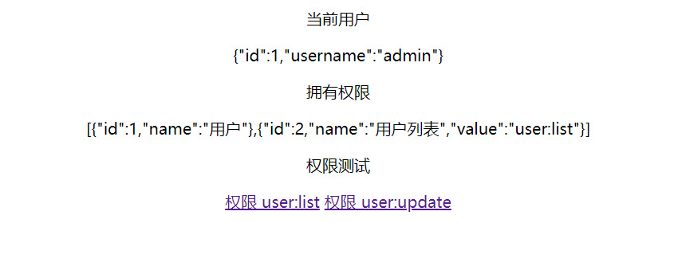

# spring-security-rbac-example

## 介绍

springboot整合spring-security实现RBAC权限控制示例

## 引用框架

| 技术             | 说明                 
| ---------------- | ------------- |
| Spring Boot      | 容器+MVC框架     
| thymeleaf        | 模板引擎    
| MyBatis          | ORM框架        
| MyBatisPlus      | mybatis通用模板      
| fastjson         | 阿里JSON工具类
| Lombok           | 简化对象封装工具    
| Druid            | 数据库连接池   

## 示例图

